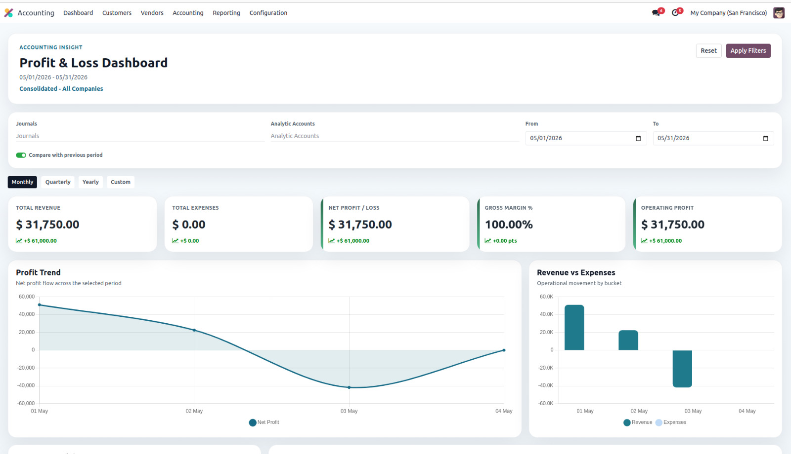
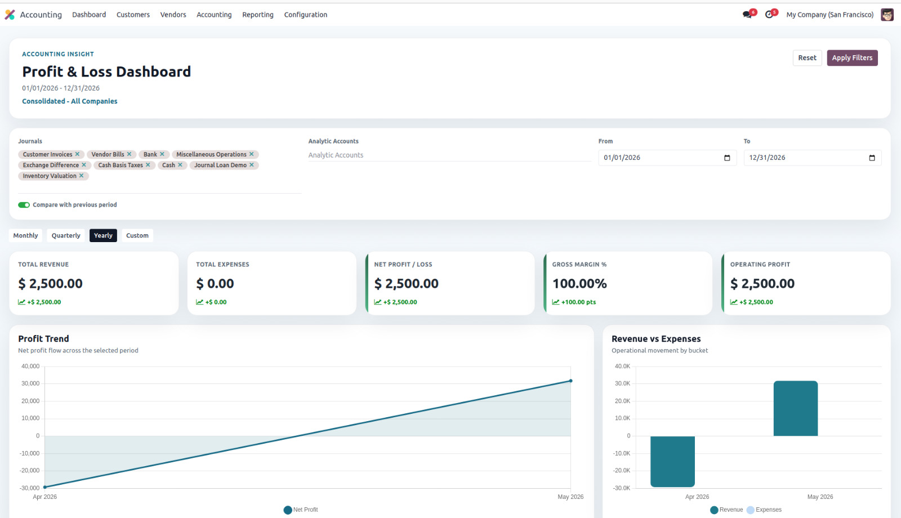

Consolidated Profit & Loss Dashboard
====================================

A modern and interactive dashboard for analyzing Profit & Loss across multiple companies.

Overview
--------

- Real-time financial insights
- Multi-company consolidation
- Clean and modern UI
- Export options (PDF / Excel)

Dashboard Overview
------------------

.. image:: dashboard_overview.png
   :width: 100%

Monthly View
------------

Yearly View
-----------

.. image:: yearly_view.png
   :width: 100%

Filters & Controls
------------------

Usage
-----

1. Go to Accounting Dashboard
2. Select filters (Journals, Dates, Analytic Accounts)
3. Choose Monthly / Quarterly / Yearly
4. Analyze KPIs and charts
